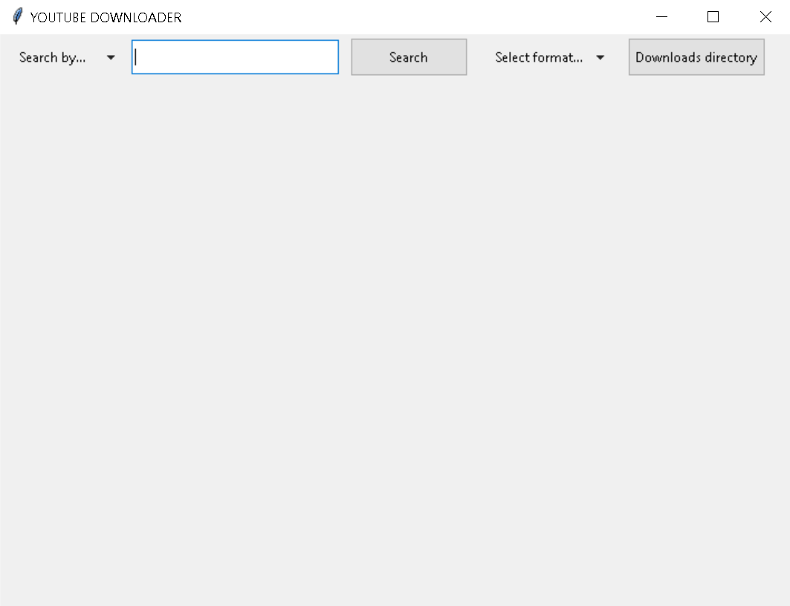

# YOUTUBE DOWNLOADER  

Tkinter app that downloads videos from youtube. 
Formats supported: webm, mp4, mkv, mp3 and wav

## How run this app  

1. You need python installed on your computer  
2. Clone this repository into your machine  
3. Install the required libraries specified in the requirements.txt file
4. Open your **terminal** (MacOS, Linux) or **cmd** (Windows), navigate to the project folder and run:  
`pipenv run python app.py` if using pipenv   
or `python app.py` if using default venv  
  
## App Functionalities  
  
### Search by name  
This will show you the top 10 results with the given name

   
  
  
### Search by link
This will show you the exact video that matches that link

    
  
  
### Select the desired file format
You can specify the file format you want, .webm is default
  
  
  
  
### Select the desired directory 
You can select the directory that the download will go to. The application remembers your last choice, even if you close it.  
  
  
    
    
### Download or watch video
Click the video you want to download or watch it first to be sure it's the one.

